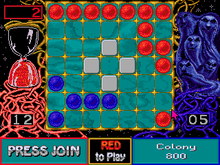

# Assegnazione Progetto

## **Ataxx** 23/24

Obiettivo: Conquistare più pedine possibili sul tavoliere.  
Tavoliere: Quadrato di 7x7 caselle.  
Pedine: Bicolori, generalmente bianche da un lato e nere dall’altro.  
Posizione iniziale: Quattro pedine sono già presenti all’inizio del gioco.  
Giocatori: Due, inizia il giocatore con le pedine nere.  
Mossa: Può essere di due tipi:  
-Tipo a: Collocare una nuova pedina adiacente (ortogonalmente o diagonalmente) a una propria pedina esistente.  
-Tipo b: Spostare una propria pedina “saltando” una casella adiacente (anche se occupata) a patto che la casella di arrivo sia libera.  
Cattura: Se al termine della mossa ci sono pedine avversarie adiacenti, queste vengono girate e diventano dell’altro colore.  
Fine del gioco: Quando tutte le caselle sono riempite o un giocatore non può muovere.  
Vittoria: Chi ha più pedine del proprio colore alla fine del gioco.  
Punteggio: Differenza tra il numero di pedine dei due giocatori.  